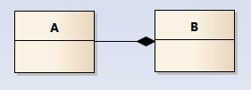
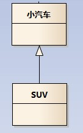

UML Unified Modeling Language 统一建模语言
用例图、类图、对象图、状态图、活动图、时序图、协作图、构件图、部署图

依赖关系：使用关系，表示某个类依赖于另外一个类，某个类的方法的参数使用了另外一个类的对象；带箭头的虚线，箭头从使用类指向被依赖的类
class Computer {
    code(): void
}
class Programmer {
    name: String,
    coding(Computer c): void
}

关联关系：是对象之间的一种引用关系，表示一个类和另外一个类之间的联系，如老师和学生、丈夫和妻子等；关联关系单向、双向，单向关联用一个带箭头的实线表示，
箭头从使用类指向被关联的类，双向关联用两个箭头或者没有箭头的实线来表示
Teacher: students List<Student>
Student: teachers: List<Teacher> courses: List<Course>
Course: 

聚合关系：聚合关系是关联关系的一种，表示整体和部分之间的关系，如学校和老师，车子和轮胎。 聚合关系在类中是通过成员对象来体现的，成员是整体的一部分，成员也可以脱离整体而存在。如老师是学校的一部分，同时老师也是独立的个体，可以单独存在。
在UML类图中，用带空心菱形的实线来表示聚合关系，菱形指向整体。
School: teachers List<Teacher>
Teacher

组合关系：组合关系是整体和部分之间的关系，也是关联关系的一种，是一种比聚合关系还要强的关系。部分对象不能脱离整体对象而单独存在，如人的身体和大脑之间的关系，大脑不能脱离身体而单独存在。
在UML类图中，用带实心菱形的实线来表示组合关系，菱形指向整体。
Body: Brain

实现关系
实现关系就是接口和实现类之间的关系。类实现了接口中的抽象方法。在UML类图中，用带空心三角箭头的虚线来表示实现关系，箭头从实现类指向接口。
大学 清华大学 北京大学

泛化关系
泛化关系其实就是父子类之间的继承关系，表示一般与特殊的关系，指定子类如何特殊化父类的特征和行为。在UML类图中，用带空心三角箭头的实线来表示泛化关系，箭头从子类指向父类。
动物 小鸟 狮子

六种关系中，从弱到强依次是：
依赖关系 < 关联关系 < 聚合关系 < 组合关系 < 实现关系 = 泛化关系